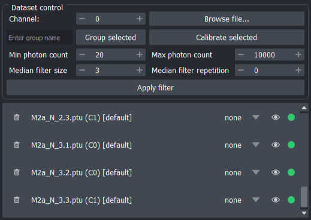

# User Guide

Two example FLIM images, along with a reference image for phasor calibration, are provided alongside FLIMari. The images provided are IMSPECTOR TIFF and PicoQuant PTU, but the following tutorials are agnostic to user image formats.

## Import FLIM Data

FLIM files can be imported using the **Browse file...** button under the the **Dataset control** section in the FLIMari main panel.

/// caption
Dataset control GUI
///

Files are selected through the native OS file manager dialog. Multiple files with different formats may be selected and imported at once. There is no upper limit to the number of files that can be imported at once, but loading many files may take a long time.

!!!note
    Only one channel is loaded at once for all selected files. If you want to analyze multiple channels in the same FLIM file, you can load the file multiple times, each time with a different channel specified.

    FLIMari channels are zero-based, meaning channel 0 is the first channel. 

## Manage FLIM Data

/// caption
Dataset list GUI
///

Each imported FLIM file is referred to as a "Dataset" (of fluorescence decay data). They are displayed as interactable UI items in the **Dataset List**. Each UI item is made of several components:

* **Delete button**: Remove the dataset item and associated FLIM data.
* **Dataset name**: Formatted as `file_name(channel)[group_name]`.
* **Display mode**: How to display the FLIM data in the viewer. See (TODO) for more information.
* **Focus button**: Hide all other images in the viewer.
* **Status indicator**: Whether this dataset has been calibrated. 
    * Red = uncalibrated
    * Green = calibrated
    * Yellow = calibration parameters have changed

Datasets can be freely selected and deselected using `SHIFT+LEFT MOUSE CLICK` and `CTRL+LEFT MOUSE CLICK`. Most FLIMari operations on datasets only affect selected datasets in the list.

Datasets can be assigned to groups. Usually this helps with organizing FLIM data obtained under the same experimental condition. To change the group of selected datasets, enter the group name in the text box, then press **Group selected**. You should see the group name changes in the list item UI.

/// caption
Enter group name in the text box, then press **Group selected** to change the group assignments of selected datasets.
///

## Prepare Calibration

For accurate Phasor analysis of FLIM data, one must account for the effect of the [Instrument Response Function](https://www.tcspc.com/doku.php/howto:how_to_work_with_the_instrument_response_function_irf) (IRF).

FLIMari implements IRF correction using the **reference image**. The reference image is the FLIM data of a sample with a known mono-exponential lifetime, acquired using the same microscope device and condition as the other biological samples.

To perform calibration using a reference image, first import its FLIM file in the calibration GUI.

/// caption
Calibration GUI
///

Calibration import accepts the same file formats as regular FLIM data. Likewise, it only imports the selected channel. Only one channel can be using as the reference for calibration at a time.

Once loaded, FLIMari will attempt to obtain the laser frequency from the file metadata. If successful, the `Laser freq.` input field will be set to the found value and turn green; otherwise, the value will need to be entered manually. `Ref. lifetime`, i.e. the fluorescence lifetime of the reference lifetime species, usually cannot be populated automatically and must be entered manually. 

After both `Laser freq.` and `Ref. lifetime` are set, press the **Compute calibration** button to calculate the calibration parameters `Phase` and `Modulation`. If successful, the input fields will be set to the calculated value and turn green. 

/// caption
Successfully computed calibration
///

!!!tip
    All automatically set values in the Calibration GUI can be manually overridden. Manually set fields will turn blue. Press the **Reset** button next to the input field to reset its value to the previously automatically set value.

## Calibrate Datasets

To calibrate datasets, simply select them in the [dataset list](tutorials.md#manage-flim-data), then press the **Calibrate selected** button. The indicator lights will turn green once the calibration completes.

/// caption
Calibrate datasets
///

!!!warning
    Calibration may succeed even if no reference file has been loaded. Such calibration uses the default `Phase=0` and `Modulation=1`, meaning the phasor coordinates are unchanged. If your calibrated datasets do not behave as expected, check whether they have been actually calibrated against the reference.

!!!tip
    Calibration parameters `Phase` and `Modulation` can be verified by importing the reference FLIM file as a regulat dataset, then calibrate it and confirm its phasor cloud centers on the universal semi-circle, at the correct lifetime position.

## Apply Filters

FLIM data often contains background pixels and pixels with low total photon counts. These pixels should not be included in FLIM analysis since they do not represent biological samples or are too noisy for any meaningful work. While the Phasor approach requires much fewer photon counts than fitting a parametric model, 25 to 30 photons are still required for accurate phasor coordinates.

FLIMari offers two simple but effective filters: photon thresholding and the median filter. These two filters are applied sequentially, with the median filter being applied first and photon thresholding last.

/// caption
Input fields for filter adjustments
///

The median filter is applied to both real and imaginary phasor coordinates independently. The filter kernel size and strength can be adjusted in the *Dataset control* section by changing the values of `Median filter size` and `Median filter repetition`. For a detailed explanation on how these parameters affect the behaviour of the median filter, please refer to the [numpy documentation](https://numpy.org/doc/stable/reference/generated/numpy.nanmedian.html).

Photon thresholding is applied once to both real and imaginary phasor coordinates after the median filter. The thresholding is always based on the total photon counts in the original data, i.e., median filter has no effect on which pixel to be excluded. 

The minimum and maximum photon threshold can be set in the **Dataset control** section by changing the values of `Min photon count` and `Max photon count`. Any pixel with a total photon count outside the specified range will be discarded during both visualization and analysis. 

!!!tip
    You can determine the optimal photon count threshold using napari's built-in colorbar.

    Make sure the dataset is in the `none` display mode (so that the image viewer shows the photon counts), then head to the napari layer list and right-click on the dataset, then select *Visualization -> colorbar*. Alternatively, you can also hover over the image to see the photon count of the pixel under the cursor.

Filters are only applied/updated when the **Apply filter** button is pressed, and only apply to selected datasets. Both the original data and filtered data are stored, so you may re-apply the filters any number of times without reloading the imported data manually.

!!!note
    Datasets store their last used filter parameters. You can select a dataset to view its filter parameters in the **Dataset control** GUI.

    If multiple datasets are selected and their filter parameter values differ, `...` will be shown instead, indicating the selected datasets contain different values. You may still override this value and apply filters to all selected datasets using a common set of parameters, as normal.

## Visualize Phasor

To visualize phasor coordinates of datasets, press the **Visualize Phasor** button to open the **Phasor Plot** widget.

/// caption
The Phasor Plot widget
///

The **Phasor Plot** widget offers three different plot styles: `contour`, `scatter`, and `hist`.

In particular, `contour` and `scatter` plots can color phasor points using different color gradients (see [matplotlib colormaps](https://matplotlib.org/stable/users/explain/colors/colormaps.html)), or according to the group assigned to them, by selecting the `by group` option in the *Color map* dropdown. The color assigned to a group is random but deterministic for a given group name.

!!!tip
    The **Phasor Plot** widget offers a simplified GUI for selecting which datasets to be plotted. Try plot isolated datasets if you find it difficult to see which phasor cloud belongs to which dataset.

!!!tip
    Applying filters to datasets also updates them in the **Phasor Plot** widget. Use the *Draw* button to refresh the canvas.

/// caption
Contour phasor plot using the "jet" color gradient
///

/// caption
Scatter phasor plot colored by groups
///

/// caption
Histogram phasor plot of a single dataset
///

!!!warning
    It is not recommended to plot multiple datasets together using the `hist` style (histogram plot). Doing so will result in datasets overwriting the histogram bins of each other. FLIMari is planning for a better implementation of histogram phasor plots in future versions.

## ROI Analysis

FLIMari supports region-of-interest (ROI) analysis directly in phasor space. This helps with identifying pixel populations based on their phasor coordinates. ROIs in FLIMari are defined as circular regions in the phasor plot and can be mapped back to the images as labelled masks.

### ROI Creation

To create a new ROI, enter a descriptive name in the text box on the right side of the **Phasor Plot** widget and press the **Add ROI** button. A circular ROI cursor will appear on the phasor plot canvas, and a corresponding control entry will be added to the ROI list.

/// caption
ROI cursor and controls in the Phasor Plot widget
///

### ROI Controls

Each ROI entry in the list provides the following controls:

* **Delete button**  
  Removes the ROI and its controls.

* **ROI name**  
  The name assigned during creation. This name cannot be modified.

* **ROI size**  
  A spinbox used to adjust the radius of the circular ROI.

* **ROI color**  
  Clicking the color swatch opens a color picker dialog, allowing the ROI outline to be customized.

To reposition an ROI, first select it in the ROI list. Then click on the desired location on the phasor plot canvas. Only one ROI can be selected and repositioned at a time.

### Mapping ROIs to Images

Once one or more ROIs have been defined, labelled image masks can be generated by pressing the **Map ROI** button. For each selected dataset, FLIMari creates a napari label layer corresponding to the ROI, named using the dataset name and a `.roi` suffix. These label layers can be further processed, exported, or combined using standard napari operations.

## UMAP Analysis

The **UMAP Analysis** widget helps you compare many datasets (FlIM images) at once by compressing entire phasor clouds into 2D points. Datasets that have similar lifetime characteristics tend to appear closer together, while more different datasets appear farther apart.

This is useful for:

* Fidning clusters of similar datasets;
* Finding outliers;
* Checking whether your experimental groups differ in the way you expect;
* Exploring which feature choices best reveal phasor cloud structures.

To access the **UMAP Analysis** widget, select all or some datasets, then press the **UMAP Analysis** button below the dataset list.

/// caption
Overview of the **UMAP Analysis** widget
///

### Image features

Image features define what lifetime characteristics are used to compare datasets. You can select any combination of:

* `photon_count`
  Total number of photons
* `g`
  Real phasor coordinate
* `s`
  Imaginart phasor coordinate
* `phi_lifetime`
  Estimated phase lifetime
* `m_lifetime`
  Estimated modulation lifetime
* `proj_lifetime`
  Projected normal lifetime
* `avg_lifetime`
  Weighted average lifetime based on `geo_tau1`, `geo_tau2`, `geo_frac1`, and `geo_frac1`.
* `geo_tau1`
  Lifetime of the first species searched using the geometric graphical method.
* `geo_tau2`
  Lifetime of the second species searched using the geometric graphical method.
* `geo_frac1`
  Fractional contribution of `geo_tau1`.
* `geo_frac2`
  Fractional contribution of `geo_tau2`.

The default selections are `g`, `s`, and `proj_lifetime`.

### Feature stats

Feature stats define *how each image feature is summarized* into a single number per dataset. The available stats are:

* `median`
* `iqr`
  Interquantile Range
* `mean`
* `std`
  Standard deviation
* `p10`
  The 10th percentile
* `p90`
  The 90th percentile

The default selections are `median` and `iqr`, which gives a general description of the distribution of the selected image features within the datasets.

Selecting more stats results in a richer description of each dataset, but can also make results harder to interpret if too many weak or noisy stats are included.

### Datasets

The **Datasets** list controls which datasets are included in the analysis. Like lists in other widgets, multi-select is supported. By deafault, all datasets are selected.

!!!warning
   If you select too few image features, feature stats, or select too few datasets, UMAP and preprocessing may fail due to not enough rows/columns in the feature matrix.

### Preprocessing

Preprocessing changes how the selected feature stats are prepared before UMAP runs. There are two available preprocessing steps:

**Normalization**:

* `robust` (default): scaling by removing the median and scale against the IQR
* `zscore`: scaling by removing the mean and scale against the standard deviation
* `none`: no scaling

It is recommended to keep `robust` unless you have a reason to change it.

**PCA**
The purpose of applying PCA before UMAP is to reduce noise and improve stability, especially when you select many features/stats. You may choose whether to run this preprocessing step. The wdiget automatically adjust the number of components based on the features/stats chosen, but you may also specify the max number of components manually through the GUI (deafult 10).

### UMAP parameters

These settings influence the “shape” of the 2D map.

* `n_neighbors`: Controls how much the map focuses on local neighborhoods vs broader structure:
    * lower values: emphasize local detail (small clusters, fine separation)
    * higher values: emphasize overall structure (smoother, larger-scale patterns)

* `min_dist`: Controls how tightly points can pack together:
    * lower values: tighter clusters
    * higher values: more spacing

* `dist_metric`: Distance rule used when comparing datasets:
    * euclidean (default)
    * manhattan
    * cosine

If you are unsure, keep the default parameters.

### Running UMAP

Press **Run UMAP** to generate the 2D plot. Each point on the plot corresponds to one selected dataset. If any datasets are unusable for the chosen feature set (e.g. no valid pixels), they will be removed.

/// caption
Example UMAP plot
///

Press **Clear plot** to reset the view, which clears the plot and discards the current embedding and clustering labels.

### Clustering

You may cluster the datasets after UMAP is computed. Press **Run clustering** to perform clustering using the current UMAP results. FLIMari provides two clustering methods: **KMeans** and **DBSCAN**. Use **KMeans** when you want the plot divided into a fixed number of groups. **DBSCAN** can determine clusters automatically based on point density.

### Coloring and labels

The points in the UMAP plot can be colored in three ways:

* `group`: colors points by dataset group, and shows a legend
* `kmeans`: colors by KMeans cluster label
* `dbscan`: colors by DBSCAN label

Additionally, the points can be annotated with the name of the dataset it corresponds to.

!!! tip
    Annotation is most useful with a small number of datasets. With many datasets it can become hard to read.

### Exporting results

Press **Export embedding (CSV)** to save a CSV file to the local file system, containing:

* Dataset identifiers: name, channel, group
* Embedding coordinates: umap1, umap2
* Clustering labels, if available: kmeans, dbscan
* The full set of computed feature stats, named as `metric:stat` (e.g. `g:median`, `proj_lifetime:iqr`)

!!! note
    Export is only available after you have successfully run UMAP.

## Summarize Datasets

TODO